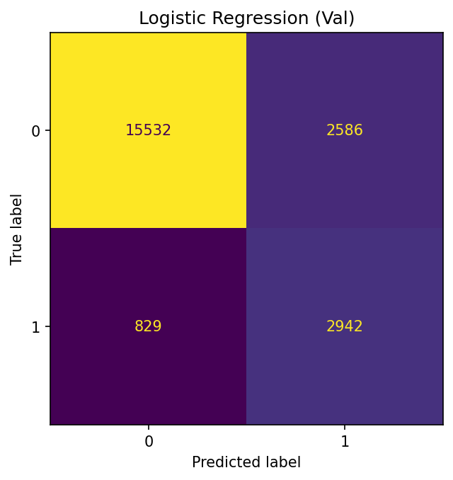
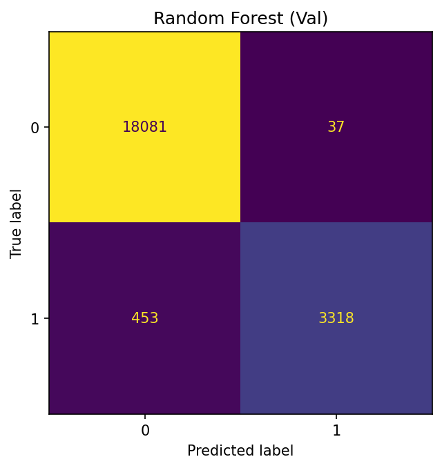
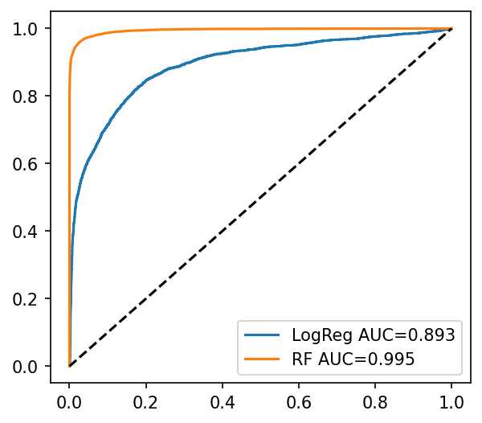

# ECG Signal Binary Classification
Classifying ECG signals into normal vs abnormal using statistical and signal-based features with baseline machine learning models.


## 📊 Overview
- **목표**: ECG(심전도) 파형 데이터를 활용해 정상 vs 비정상 신호를 분류하는 머신러닝 모델 개발
- **핵심 가치**: 조기 이상 신호 탐지로 의료진의 진단 보조 및 환자 안전성 향상에 기여


## 🎯 Key Achievements
- MIT-BIH 기반 정상/비정상 이진 분류 모델 구현  
- Logistic Regression, Random Forest 등 baseline 모델 성능 비교  
- 최종 모델(Random Forest)로 Test Accuracy **97.6%**, F1-score **0.925** 달성  
- 불균형 데이터에서도 강건하게 성능 유지, 과적합 없이 안정적 일반화 확인


## 📈 Dataset Information
- **출처**: [Heartbeat Dataset (Kaggle)](https://www.kaggle.com/datasets/shayanfazeli/heartbeat)  
- **기반 데이터**: MIT-BIH Arrhythmia Database (109,446 샘플)  
- **라벨**: 0 = 정상(90,589), 1 = 비정상(18,857) → 약 5:1의 불균형  
- **신호 형태**: 각 심박당 187 포인트의 ECG 시계열 데이터 (CSV는 행당 188열 = 187 포인트 + 1 라벨로 구성)
- **EDA Insights**:  
  - 원시 파형만으로는 정상/비정상 구분이 뚜렷하지 않음  
  - 평균 ± 표준편차 그래프에서 비정상 클래스의 변동 폭이 더 큼


## 🔧 Tech Stack
- **데이터 처리 & 분석**  
  - pandas, numpy: 데이터 조작 및 전처리  
  - biosppy, scipy: ECG 파형 처리 및 특징 추출  
- **머신러닝**  
  - scikit-learn: Logistic Regression, Random Forest  
  - class_weight, stratified split: 불균형 데이터 대응  
- **시각화**  
  - matplotlib, seaborn: 파형 및 분포 시각화  


## 🗂 Project Structure
```
ecg-classification/
├─ notebooks/
│   ├─ 01_eda.ipynb        # 탐색적 데이터 분석 및 전처리
│   └─ 02_modeling.ipynb   # 모델 학습 및 평가
├─ figures/                # 시각화 결과물
└─ README.md
```
- **Notebooks**:  
  - [01_eda.ipynb](notebooks/01_eda.ipynb)  
  - [02_modeling.ipynb](notebooks/02_modeling.ipynb)

- **Key Figures**

Confusion Matrix (LogReg / RF)  
   

ROC Curve  
  


## ✅ Results
### Validation Set
- **Logistic Regression**  
  - Accuracy: **0.844**  
  - F1-score: **0.633**  
  - ROC-AUC: **0.893**  

- **Random Forest**  
  - Accuracy: **0.978**  
  - F1-score: **0.931**  
  - ROC-AUC: **0.995**  

### Test Set (Final Model = Random Forest)
- Accuracy: **0.976**  
- F1-score: **0.925**  

### Interpretation
- Logistic Regression은 baseline 성능은 확보했으나, ECG의 복잡한 패턴 반영이 부족해 Abnormal 탐지율이 낮음
- Random Forest는 다양한 파형 특징(진폭 변화, 불규칙성 등)을 효과적으로 포착하여 Accuracy/F1/ROC-AUC에서 우수한 성능을 보였음
- Validation과 Test 결과가 유사하여 **과적합 없이 안정적 일반화**를 달성했음을 확인
- **최종 모델은 Random Forest로 선택** (향후: 하이퍼파라미터 튜닝 및 CNN/RNN 기반 딥러닝 모델로 확장 가능)
